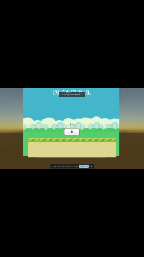

# Flappy Owl

## Overview

Welcome to **Flappy Owl**, an engaging and delightful game that puts a unique spin on the classic Flappy Bird concept. Soar through the skies, avoid obstacles, and challenge yourself to achieve the highest score.

## Gameplay

Flappy Owl offers an experience similar to Flappy Bird:

- **Controls:** Click or tap to make the owl fly.
- **Objective:** Navigate the owl through pipes without colliding to earn points.

## Screenshots of Gameplay

## Features

- **Unity Engine:** Developed using Unity, taking advantage of its powerful features.
- **Custom Assets:** Created custom assets using Photoshop to give the game a unique and visually appealing style.
- **Sound Effects:** Added immersive sound effects for a more engaging gaming experience.
- **Scripting in C#:** Implemented functionality, including bird flight, obstacle duplication, and scoring system, using C#.
- **Project Duration:** October 2023 to December 2023.
- **Learning Resources:** Utilized tutorial videos, courses, and assistance from ChatGPT to overcome challenges and improve the project.

## How to Play

Visit the [Flappy Owl Web Game](https://play.unity.com/mg/other/fo-23nz0q) to play the game instantly. No downloads or installations required.

1. **Access the Game:** Open the [Flappy Owl Web Game](https://play.unity.com/mg/other/fo-23nz0q) in your web browser.
2. **Controls:** Click or tap to make the owl fly.
3. **Objective:** Navigate the owl through pipes without colliding to earn points.

## Credits

- **Tutorial Videos and Courses:**
  - Youtube, Outscale and Coursera

- **ChatGPT:**
  - Acknowledge the assistance from ChatGPT for resolving bugs and errors.

## License

This project is licensed under the [MIT License](LICENSE).

## Acknowledgments

Give credit to any third-party assets used and thank the community for support.

---
